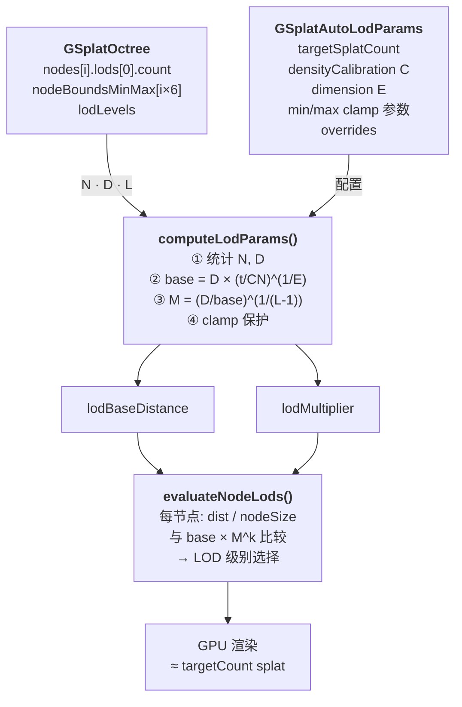
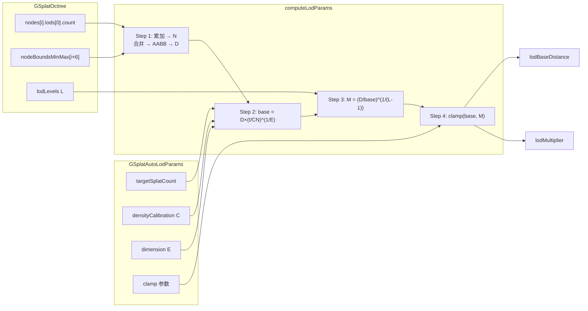
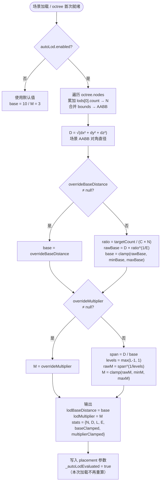
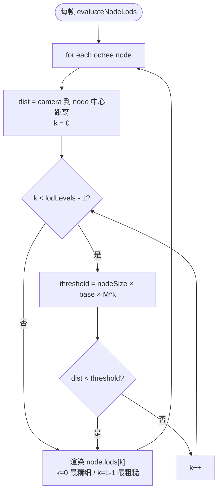

# 大场景 3DGS 自动计算 LOD 距离参数设计方案

## 背景

现有 PlayCanvas 3DGS LOD 切换方案需要用户手动设置 `lodBaseDistance`（默认 10）和 `lodMultiplier`（默认 3）。对于大场景（2M ~ 100M+ 高斯球），手动调参困难——场景越大/越密，参数应越早切换、覆盖越广。

本方案在 octree 加载完成后，利用已有的资产统计数据（`N`、`lodLevels`、节点 AABB）自动反算这对参数。

---

## 输入与已知条件

| 符号 | 含义 | 来源 |
|------|------|------|
| `N` | 总高斯球数（LOD 0 层累计） | `nodes[i].lods[0].count` 求和 |
| `L` | octree 实际可用 LOD 级数 | `GSplatOctree.lodLevels`（如 4） |
| `D` | 场景 AABB 对角直径 | `nodeBoundsMinMax` 合并后取对角 |
| `targetCount` | 目标同时可见 splat 数（GPU 预算） | 用户配置（如 1M） |
| `C` | 密度校准常数 | 用户配置（默认 2.0，覆盖非均匀分布） |
| `E` | 有效场景维度 | 用户配置或相机推断（1=线性, 2=地面俯视, 3=体积） |

**常量约定**：
- `lodBaseDistance` 默认值：**10**（场景中等、密度中等时的合理起始值）
- `lodMultiplier` 默认值：**3**
- `lodLevels` 典型值：4

---

## 数学推导

### 目标：让"可见 splat 数"接近 targetCount

**Step 1：建立可见数量模型**

可见splats数取决于"视锥与场景的交集维度"——不同相机位置决定了不同的维度模型。

#### 模型对比

| 场景类型 | 相机位置 | 视锥增长规律 | 示例 |
|---------|---------|-------------|------|
| **E=3 (体积)** | 场景内部 | 视锥体积 ∝ d³ | 地面行走、室内漫游 |
| **E=2 (面积)** | 场景上方远眺 | 视锥截取地表面积 ∝ d² | 无人机航拍、俯瞰台 |
| **E=1 (线性)** | 沿线性轨迹 | 视锥截取长度 ∝ d | 公路、河道、隧道 |

#### 体积模型 (E=3)：地面视角

```
        ┌─────────────┐  远处：大体积 → 多splat
        │    ╱    ╲    │
        │   ╱      ╲   │
        │  ╱   📷   ╲  │  ← 相机在体积内部
        │ ╱        ╲ │
        └─────────────┘  近处：小体积 → 少splat
```

第 i 个 LOD 壳层内可见 splat 数：

$$s_i \approx \text{density} \times V_{\text{shell}} = \frac{N}{V_{\text{scene}}} \times \frac{4\pi}{3}(d_i^3 - d_{i-1}^3)$$

其中 $d_i = base \times M^i$。

#### 面积模型 (E=2)：航拍俯视

```
           📷  ← 无人机高处
          ╱  ╲
         ╱    ╲
        ╱      ╲        远处：大面积 → 多splat（稠密）
       ╱        ╲
     ──────────────       ← 地面：splat近似2D分布
```

视锥截取地面面积 ∝ d²，近处稀疏、远处稠密：

$$s_i \approx \frac{N}{A_{\text{scene}}} \times (d_i^2 - d_{i-1}^2)$$

#### 通用统一公式

将两种模型统一为维度参数 E：

$$N_{\text{visible}} \approx C \cdot N \cdot \left(\frac{base}{D}\right)^E$$

> **关于常数 C**：C 是经验校准系数，受以下因素综合影响：
> - **LOD 衰减比**：octree 构建时每级减少的 splat 比例（常见 ~1/8 或 ~1/4）
> - **多级壳层求和**：多个 LOD 层可见 splat 的几何级数累加
> - **场景非均匀性**：真实密度分布不均、视锥遮挡、远端被近端遮挡
>
> C 值难以严格解析推导，需通过实测标定（固定 base/M，渲染后反解 C）。
> 不同 multiplier 下 C 值一般不同（M 越大，C 通常越小）。
> 当前默认使用 **C=2.0** 作为保守起点——偏大意味着 base 偏小、LOD 切换更早，GPU 更安全。
> 实际部署后应通过实测数据进行校准。

**Step 2：反解 base**

令 $N_{\text{visible}} = targetCount$：

$$base = D \times \left(\frac{targetCount}{C \cdot N}\right)^{1/E}$$

> E=3 时退化为立方根；E=2 时退化为平方根。维度 E 越大，base 越小（LOD 切换越早），因为体积随距离增长更快。

**Step 3：反解 multiplier**

最远 LOD 层级大致应覆盖整个场景半径/直径。用级数递推：

$$base \times M^{L-1} \approx D \quad\Rightarrow\quad M = \left(\frac{D}{base}\right)^{1 / (L - 1)}$$

> 用 $L-1$ 是因为 LOD 0 已覆盖 base 以内区域，真正递推的是第 1 级到最后一级。
> **multiplier 公式不受 E 影响**——覆盖约束始终是几何级数铺满整个距离范围。

**Step 4：安全 clamp**

$$M_{\text{final}} = \text{clamp}(M_{\text{raw}},\; M_{\min}=2.0,\; M_{\max}=5.0)$$

$$base_{\text{final}} = \text{clamp}(base_{\text{raw}},\; base_{\min},\; base_{\max})$$

---

## 完整公式一图流

```
输入: N, D, L, targetCount, C, E (维度)
            │
   ┌────────┴────────────────────────────────────┐
   │  base = D × (targetCount / (C × N))^(1/E)   │
   │  base = clamp(base, baseMin, baseMax)       │
   │                                             │
   │  E=3 → 立方根 (地面视角)                     │
   │  E=2 → 平方根 (航拍俯视)                     │
   │  E=1 → 直接比 (线性场景)                     │
   └────────┬────────┘
            │
   ┌────────┴────────┐
   │  levels = max(L - 1, 1)
   │  M    = (D / base)^(1 / levels)
   │  M    = clamp(M, 2.0, 5.0)
   └────────┬────────┘
            │
  输出: lodBaseDistance = base, lodMultiplier = M
```

---

## 计算函数实现

```javascript
/**
 * 根据 octree 实际统计信息自动计算 LOD 距离参数。
 *
 * 数学推导：
 *   base = D × (targetCount / (C × N))^(1/E)
 *   multiplier = (D / base)^(1 / (lodLevels - 1))
 *
 * @param {GSplatOctree} octree - 已加载的 octree 资产
 * @param {Object} config - 自动 LOD 配置
 * @param {number} config.targetSplatCount - 目标可见 splat 数（默认 1000000）
 * @param {number} config.densityCalibration - 密度校准常数（默认 2.0）
 * @param {number} config.dimension - 有效场景维度 E（1=线性, 2=地面俯视, 3=体积，默认 3）
 * @param {number} config.minBaseDistance - base 下限（默认 1.0）
 * @param {number} config.maxBaseDistance - base 上限（默认 200）
 * @param {number} config.minMultiplier - multiplier 下限（默认 2.0）
 * @param {number} config.maxMultiplier - multiplier 上限（默认 5.0）
 * @param {number|null} [config.overrideBaseDistance] - 强制覆盖 base（跳过公式）
 * @param {number|null} [config.overrideMultiplier] - 强制覆盖 multiplier（跳过公式）
 * @returns {{ lodBaseDistance: number, lodMultiplier: number, stats: Object }}
 */
function computeLodParams(octree, config) {
    // Step 1: 统计 N（LOD 0 总 splat 数）和 D（场景 AABB 对角直径）
    let totalSplatCount = 0;
    let minX = Infinity, minY = Infinity, minZ = Infinity;
    let maxX = -Infinity, maxY = -Infinity, maxZ = -Infinity;

    const bounds = octree.nodeBoundsMinMax;
    const n = octree.nodes.length;
    for (let i = 0; i < n; i++) {
        const lod = octree.nodes[i].lods[0];
        if (lod) totalSplatCount += lod.count;
        const b = i * 6;
        if (bounds[b]   < minX) minX = bounds[b];
        if (bounds[b+1] < minY) minY = bounds[b+1];
        if (bounds[b+2] < minZ) minZ = bounds[b+2];
        if (bounds[b+3] > maxX) maxX = bounds[b+3];
        if (bounds[b+4] > maxY) maxY = bounds[b+4];
        if (bounds[b+5] > maxZ) maxZ = bounds[b+5];
    }

    const dx = maxX - minX, dy = maxY - minY, dz = maxZ - minZ;
    const sceneDiameter = Math.sqrt(dx*dx + dy*dy + dz*dz);
    const lodLevels = octree.lodLevels;

    // Step 2: 公式计算 base（支持任意维度 E）
    const E = config.dimension ?? 3;  // 默认体积模型
    let base;
    let baseClamped = false;
    if (config.overrideBaseDistance != null) {
        base = config.overrideBaseDistance;
    } else {
        const ratio = config.targetSplatCount / (config.densityCalibration * Math.max(totalSplatCount, 1));
        const rawBase = sceneDiameter * Math.pow(Math.max(ratio, 1e-6), 1 / E);
        base = Math.max(config.minBaseDistance, Math.min(config.maxBaseDistance, rawBase));
        baseClamped = (rawBase !== base);
    }

    // Step 3: 公式计算 multiplier
    let multiplier;
    let multiplierClamped = false;
    if (config.overrideMultiplier != null) {
        multiplier = config.overrideMultiplier;
    } else {
        const span = sceneDiameter / Math.max(base, 1e-3);
        const levels = Math.max(lodLevels - 1, 1);
        const rawM = Math.pow(span, 1 / levels);
        multiplier = Math.max(config.minMultiplier, Math.min(config.maxMultiplier, rawM));
        multiplierClamped = (rawM !== multiplier);
    }

    return {
        lodBaseDistance: base,
        lodMultiplier: multiplier,
        stats: {
            totalSplatCount,
            sceneDiameter,
            lodLevels,
            dimension: E,
            baseRaw: config.overrideBaseDistance ? null : sceneDiameter * Math.pow(config.targetSplatCount / (config.densityCalibration * Math.max(totalSplatCount, 1)), 1 / E),
            multiplierRaw: config.overrideMultiplier ? null : Math.pow(sceneDiameter / Math.max(base, 1e-3), 1 / Math.max(lodLevels - 1, 1)),
            baseClamped,
            multiplierClamped
        }
    };
}
```

### C++ 实现

```cpp
#include <cmath>
#include <cstdint>
#include <algorithm>
#include <limits>

struct AutoLodConfig {
    double targetSplatCount    = 1'000'000.0;
    double densityCalibration  = 2.0;
    double dimension           = 3.0;     // 有效场景维度 E（1=线性, 2=地面俯视, 3=体积）
    double minBaseDistance     = 1.0;
    double maxBaseDistance     = 200.0;
    double minMultiplier       = 2.0;
    double maxMultiplier       = 5.0;
};

struct LodNodeLod {
    int32_t fileIndex;
    int64_t offset;
    int64_t count;
};

struct LodNode {
    LodNodeLod lods[8];   // 最多支持 8 级 LOD，lods[0] 为最精细层
    int32_t    lodCount;  // 实际有效 LOD 级数
};

struct AutoLodResult {
    double lodBaseDistance;
    double lodMultiplier;

    // 统计信息，辅助调试
    int64_t totalSplatCount;
    double  sceneDiameter;
    int32_t lodLevels;
    double  dimension;
    bool    baseClamped;
    bool    multiplierClamped;
};

/**
 * 根据 octree 节点数据自动计算 LOD 距离参数。
 *
 * 公式：
 *   base       = D × (targetCount / (C × N))^(1/E)
 *   multiplier = (D / base)^(1 / (lodLevels - 1))
 *
 * @param nodes     octree 叶节点数组
 * @param nodeCount 节点数量
 * @param bounds    节点 AABB 紧凑数组，长度 nodeCount * 6
 *                  每节点 6 个浮点数：[minX minY minZ maxX maxY maxZ]
 * @param lodLevels octree 实际 LOD 级数
 * @param config    自动 LOD 配置
 */
AutoLodResult computeLodParams(
    const LodNode*   nodes,
    int32_t          nodeCount,
    const float*     bounds,
    int32_t          lodLevels,
    const AutoLodConfig& config)
{
    // ── Step 1: 统计 N (LOD 0 splat 总数) 与场景 AABB ──────────────
    int64_t totalSplatCount = 0;

    float minX = std::numeric_limits<float>::infinity();
    float minY = std::numeric_limits<float>::infinity();
    float minZ = std::numeric_limits<float>::infinity();
    float maxX = -std::numeric_limits<float>::infinity();
    float maxY = -std::numeric_limits<float>::infinity();
    float maxZ = -std::numeric_limits<float>::infinity();

    for (int32_t i = 0; i < nodeCount; ++i) {
        if (nodes[i].lodCount > 0 && nodes[i].lods[0].count > 0) {
            totalSplatCount += nodes[i].lods[0].count;
        }
        const int32_t b = i * 6;
        if (bounds[b    ] < minX) minX = bounds[b    ];
        if (bounds[b + 1] < minY) minY = bounds[b + 1];
        if (bounds[b + 2] < minZ) minZ = bounds[b + 2];
        if (bounds[b + 3] > maxX) maxX = bounds[b + 3];
        if (bounds[b + 4] > maxY) maxY = bounds[b + 4];
        if (bounds[b + 5] > maxZ) maxZ = bounds[b + 5];
    }

    // 场景 AABB 对角直径
    const float dx = maxX - minX;
    const float dy = maxY - minY;
    const float dz = maxZ - minZ;
    const double sceneDiameter = std::sqrt(
        static_cast<double>(dx) * dx +
        static_cast<double>(dy) * dy +
        static_cast<double>(dz) * dz);

    const double E = config.dimension;

    // ── Step 2: 公式计算 base（支持任意维度 E）────────────────────
    const double safeN = static_cast<double>(std::max(totalSplatCount, int64_t{1}));
    const double ratio = config.targetSplatCount / (config.densityCalibration * safeN);

    // base = D × (max(ratio, 1e-6))^(1/E)   ← 数值保护
    const double rawBase = sceneDiameter * std::pow(std::max(ratio, 1e-6), 1.0 / E);
    const double base = std::clamp(rawBase, config.minBaseDistance, config.maxBaseDistance);
    const bool baseClamped = (base != rawBase);

    // ── Step 3: 公式计算 multiplier ───────────────────────────────
    const double safeBase = std::max(base, 1e-3);
    const double span     = sceneDiameter / safeBase;
    const double levels   = std::max(1.0, static_cast<double>(lodLevels - 1));

    // M = span^(1 / levels)
    const double rawM = std::pow(span, 1.0 / levels);
    const double multiplier = std::clamp(rawM, config.minMultiplier, config.maxMultiplier);
    const bool multiplierClamped = (multiplier != rawM);

    return {
        base,
        multiplier,
        totalSplatCount,
        sceneDiameter,
        lodLevels,
        E,
        baseClamped,
        multiplierClamped
    };
}
```

**与 JS 实现的对应关系**：

| JS 代码 | C++ 等价 | 说明 |
|---------|---------|------|
| `Math.pow(x, 1/E)` | `std::pow(x, 1.0 / E)` | 任意次方根，E=3 时等价于立方根 |
| `Math.pow(a, b)` | `std::pow(a, b)` | 幂运算 |
| `Math.max(a, b)` | `std::max(a, b)` | - |
| `Math.sqrt(x)` | `std::sqrt(x)` | - |
| `Math.min(a, b)` / `Math.max` | `std::clamp(v, lo, hi)` | C++17，等价于 `max(lo, min(hi, v))` |
| `Infinity` | `std::numeric_limits<float>::infinity()` | 浮点无穷大 |
| `config.overrideBaseDistance` | （未包含） | C++ 侧通常由上层逻辑处理覆盖参数 |

C++ 实现适合在**离线构建工具**（生成 octree 时预计算并写入 `lod-meta.json`）或 **Native Viewer** 中使用，与运行时 JS 引擎共享同一套公式，保证双端参数一致。

---

## 配置类（建议挂在 `GSplatParams`）

```javascript
class GSplatAutoLodParams {
    /** 是否启用自动 LOD 参数计算。关闭时使用默认值或手动值。 */
    enabled = false;

    /** 目标屏幕可见 splat 数（GPU 预算） */
    targetSplatCount = 1_000_000;

    /** 密度校准常数（覆盖非均匀分布假设，越高 base 越小，切换越早） */
    densityCalibration = 2.0;

    /**
     * 有效场景维度（E）。
     * 1 = 线性场景（公路、河道）
     * 2 = 地面俯视（无人机航拍）
     * 3 = 体积场景（地面行走、室内漫游）
     */
    dimension = 3;

    /** base 距离下限（世界单位） */
    minBaseDistance = 1.0;

    /** base 距离上限 */
    maxBaseDistance = 200;

    /** multiplier 下限 */
    minMultiplier = 2.0;

    /** multiplier 上限 */
    maxMultiplier = 5.0;

    /** 强制覆盖 base（跳过公式）。null = 使用公式 */
    overrideBaseDistance = null;

    /** 强制覆盖 multiplier（跳过公式）。null = 使用公式 */
    overrideMultiplier = null;
}
```

---

## 不同场景计算示例

以 `targetCount = 1M`, `C = 2.0`, `lodLevels = 4` 为前提。

### 地面视角（E=3，体积模型）

| 场景 | N | S (边长) | D (对角) | base 计算值 | multiplier 计算值 |
|------|-------|----------|----------|------------|-------------------|
| 室内房间 | 2M | 10 | ~17 | **2.4** | 2.0 (clamp) |
| 户外街区 | 10M | 100 | ~173 | 6.3 | 2.5 |
| 城市片区 | 50M | 500 | ~866 | 12.9 | 3.1 |
| 航拍大场景 | 100M | 1000 | ~1732 | 20.4 | 3.3 |
| 超大规模 | 200M | 2000 | ~3464 | 32.3 | 3.5 |
| 极端 | 1000M | 5000 | ~8660 | 58.2 | 3.8 |

**观察**：N 增加 500 倍（2M → 1000M），base 仅增加约 24 倍（∛500 ≈ 7.9），multiplier 仅从 2.0 → 3.8。公式符合"三维体积"直觉。

### 航拍俯视（E=2，面积模型）

同一组场景参数，仅将 E 从 3 改为 2：

| 场景 | N | D (对角) | base (E=3) | base (E=2) | M (E=3) | M (E=2) |
|------|-------|----------|------------|------------|---------|---------|
| 户外街区 | 10M | ~173 | 6.3 | **13.1** | 2.5 | 2.2 |
| 城市片区 | 50M | ~866 | 12.9 | **36.8** | 3.1 | 2.6 |
| 航拍大场景 | 100M | ~1732 | 20.4 | **65.1** | 3.3 | 2.6 |
| 超大规模 | 200M | ~3464 | 32.3 | 109.6 | 3.5 | 2.8 |
| 极端 | 1400M | 1600 | 11.4 | **30.2** | 5.0 (clamp) | **3.8** |

> **1400M / D=1600 示例**：地面视角 base=11.4、M=5.0（被 clamp）；航拍视角 base=30.2、M=3.76（更温和）。
> 航拍下 base 更大 = 精细 LOD 保持更远，M 更小 = LOD 切换更平缓，因为面积增长（d²）比体积增长（d³）慢。

**观察**：E=2 时 base 显著增大（平方根 vs 立方根），multiplier 更温和。这符合航拍场景的直觉——无人机从高处俯瞰，近处稀疏、远处稠密，不需要像地面行走那样激进地切换 LOD。

---

## 接入点（何时触发计算）

建议在 octree 加载完成时计算一次：

```javascript
// gsplat-octree-instance.js 首次 evaluate 前
if (this._autoLodEvaluated === false && this.octree?.files?.length) {
    const cfg = this._scene.gsplat.autoLod;
    if (cfg?.enabled) {
        const result = computeLodParams(this.octree, cfg);
        placement.lodBaseDistance = result.lodBaseDistance;
        placement.lodMultiplier = result.lodMultiplier;
        this._autoLodEvaluated = true;
        // 可选：Debug.log 输出实际参数与 stats 便于调试
    }
}
```

**只在首次计算一次**，避免 octree 节点流式加载时频繁重算；用户后续手动修改参数不会被覆盖（因为公式不再触发）。

---

## 与现有机制的关系

| 机制 | 关系 |
|------|------|
| `lodBaseDistance` 默认值 | 被 autoLod 覆盖；不启用 `autoLod` 时仍使用默认 10 |
| `lodRangeMin`/`lodRangeMax` | 不受影响，autoLod 只决定距离曲线 |
| `splatBudget` | 与 autoLod **互补**：autoLod 给出初始曲线，splatBudget 在运行时动态纠偏 |
| `lodBehindPenalty` | 不受影响，作用在"已算出的距离"之上 |
| 预算平衡器 | 在 autoLod 输出基础上做全局调整，无冲突 |

推荐组合：
```javascript
app.scene.gsplat.autoLod.enabled = true;
app.scene.gsplat.splatBudget = 2_000_000; // 双重保险
```

---

## 调试 / 监控建议

1. **Stats 对象返回 raw 值**：用于排查"是否被 clamp 卡住"——如果 `baseClamped = true`，提示用户场景可能超出模型假设，需调整参数
2. **调试命令**：
   ```javascript
   // 打印当前 octree 的自动 LOD 计算结果
   console.log(computeLodParams(octree, app.scene.gsplat.autoLod).stats);
   ```
3. **debug visualization**：配合 `GSPLAT_DEBUG_LOD` / `GSPLAT_DEBUG_NODE_AABBS` 观察切换是否合理

---

## 场景维度 E 的确定方法

维度 E 决定了 LOD 距离增长的速度规律。三种确定策略：

### 方案 1：手动配置（推荐起步使用）

```javascript
app.scene.gsplat.autoLod.dimension = 3; // 默认：地面行走、室内
app.scene.gsplat.autoLod.dimension = 2; // 航拍俯视
app.scene.gsplat.autoLod.dimension = 1; // 线性场景（公路、河道）
```

适用场景：相机运动模式固定（FPS、无人机、轨道车）。

### 方案 2：从相机高度自动推断

根据相机高度相对场景尺寸的比例，动态选择 E：

```javascript
function inferDimension(camera, sceneExtent) {
    const heightRatio = camera.worldPosition.y / sceneExtent;

    if (heightRatio > 2.0) {
        return 2;    // 高空俯视 → 地表面积模型
    } else if (heightRatio > 0.5) {
        return 2.5;  // 中间高度 → 混合模型
    } else {
        return 3;    // 低空/地面 → 体积模型
    }
}
```

适用场景：相机可能在不同高度间切换（如 RTS 游戏、可缩放视角）。

### 方案 3：运行时自适应（高级）

统计实际渲染 splat 数，与公式预测值对比，动态微调 E：

```javascript
// 在 evaluateNodeLods 结束后统计
const actualVisible = currentRenderedSplatCount;
const predicted = C * N * Math.pow(base / D, E);
const error = actualVisible / predicted;

// error > 1 说明实际太多 → 可能 E 偏大（体积模型过乐观）
// error < 1 说明实际太少 → 可能 E 偏小（面积模型过保守）
if (error > 1.5 && E < 3) E += 0.1;
else if (error < 0.7 && E > 1) E -= 0.1;
```

适用场景：无法提前确定相机模式，或场景结构复杂不均匀。

### 混合场景

实际项目中，一个场景可能同时包含地面行走和无人机视角。建议：

1. **按相机预设切换**：根据当前启用的相机类型加载不同 preset
2. **多 octree 实例独立配置**：地面物体用 E=3，天空/远景用 E=2
3. **保守选择 E=2.5**：介于两者之间，对大多数场景可接受

---

## Tradeoff 与已知局限

1. **均匀密度假设**：对"空旷区域 + 局部密集建筑"不均匀场景不准确——通过 `densityCalibration` 调节或用 `splatBudget` 兜底
2. **单次计算**：仅首次触发，不适用于后续动态添加节点的扩展场景——可改为节点数变化时重新计算
3. **依赖 `lodLevels` 准确性**：若 octree 级数不足（如只有 2 级），公式给出的 multiplier 上限 clamp 可能导致覆盖不完整——建议配合 `splatBudget` 使用
4. **base 下限保护**：`minBaseDistance = 1.0`，避免极密集场景把 base 推得太近导致 GPU 瞬间过载
5. **维度 E 选择不确定**：E=2（航拍）和 E=3（地面）对 base 影响显著（平方根 vs 立方根），若场景同时包含两种视角，需手动配置或使用运行时自适应机制

---

## 模块框图

### 系统上下文图



### 数据流图



---

## 计算流程图

### 主流程



### per-节点 LOD 选择流程（evaluateNodeLods 参考）



> **关键关系**：`base` 控制 LOD 0→1 的切换距离起点，`M` 控制每级之间的距离放大比，`nodeSize` 使大节点在更远处保持精细 LOD。

---

## 公式速查卡

| 量 | 公式 | E=3（地面） | E=2（航拍） | E=1（线性） |
|----|------|------------|------------|------------|
| base | `D × (targetCount / (C×N))^(1/E)` | 立方根 | 平方根 | 直接比 |
| M | `(D / base)^(1 / (L-1))` | — | — | — |
| base clamp | `[1.0, 200]` | — | — | — |
| M clamp | `[2.0, 5.0]` | — | — | — |
| 触发时机 | octree 首次加载完成（仅一次） | — | — | — |
