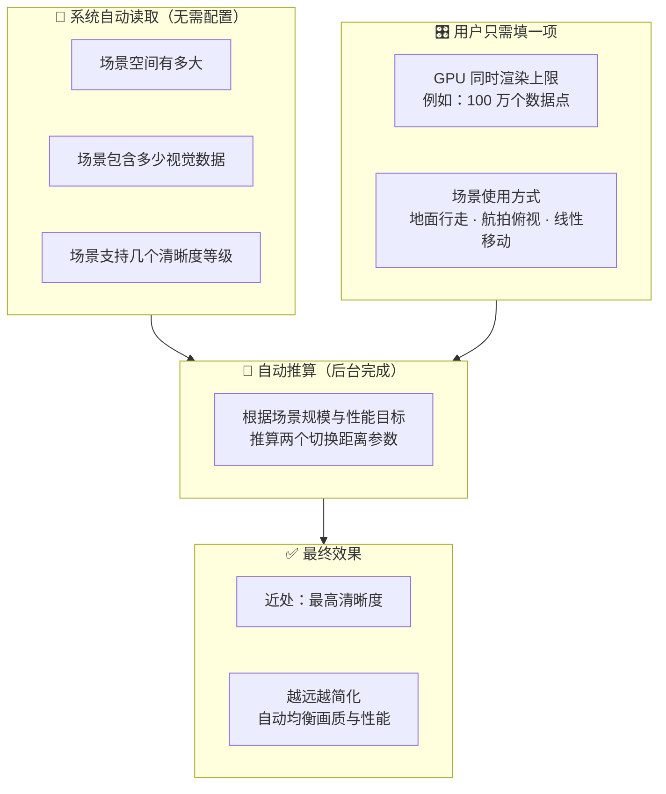
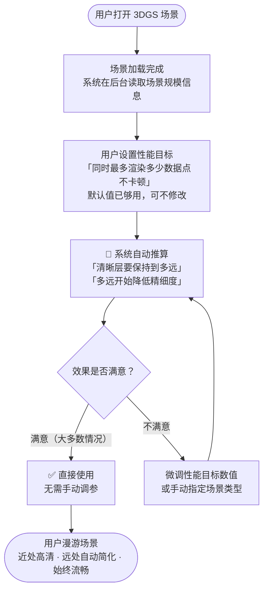
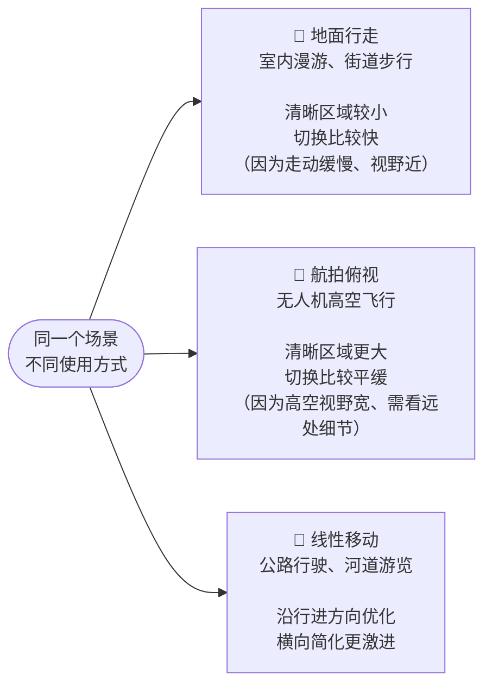
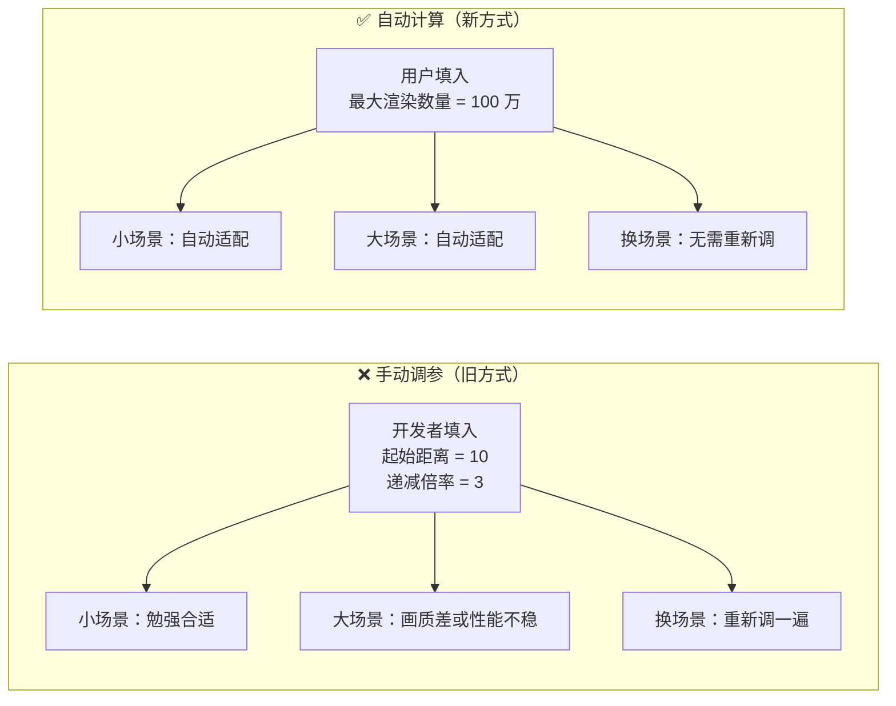
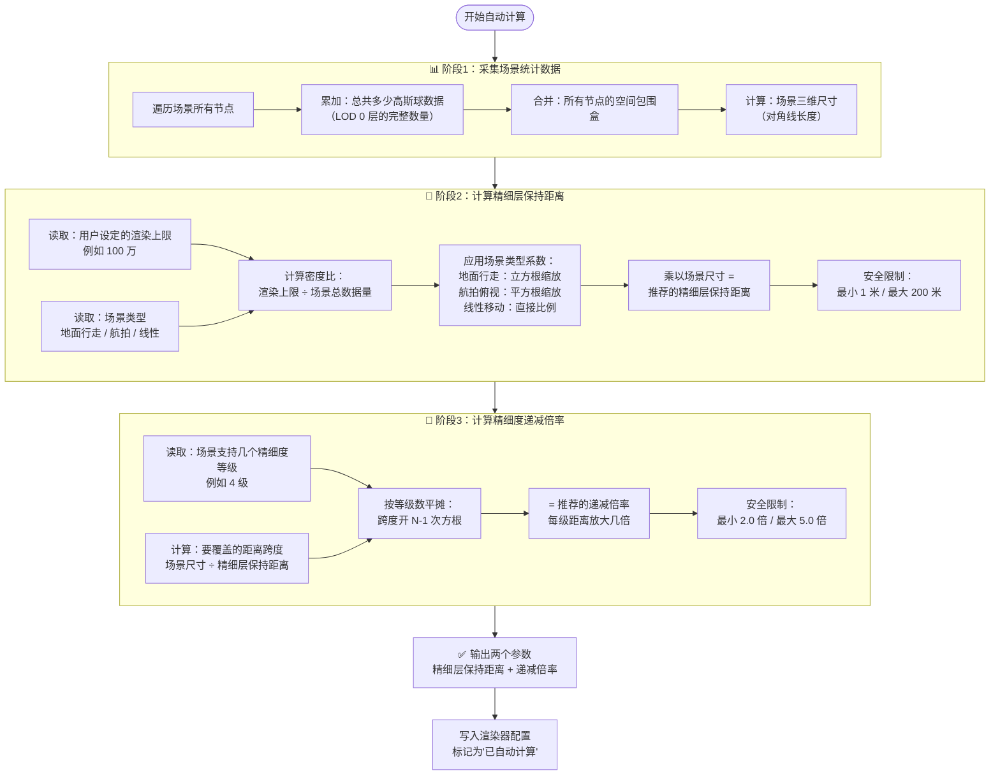
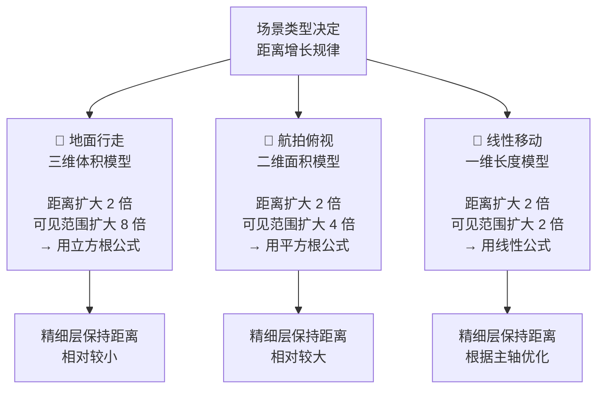

# 自动 LOD 参数计算 — 产品说明

> 面向产品经理的非技术说明

---

## 这个功能解决什么问题？

3DGS 场景越大，包含的视觉数据越多。渲染时需要控制"同一时刻屏幕上处理多少数据"，否则会导致卡顿。

**以前**：需要开发者手动填两个参数，凭经验调试，场景大小不同参数差异很大，调错了要么卡顿要么画质差。

**现在**：系统根据场景自身的规模，**自动推算**合适的参数——开发者只需告诉系统"希望最多同时渲染多少"，其余交给算法。

---

## 图 1：系统做什么（模块概念图）

---

## 图 2：工作流程（使用流程图）

---

## 图 3：场景类型如何影响效果

不同使用方式下，清晰度的切换策略应该不同。用户或开发者可以提前告知系统是哪种使用方式：

---

## 图 4：与手动调参的对比

---

## 一句话总结

> 告诉系统「你希望渲染多流畅」,系统自动决定「多远的地方开始降低精细度」。
> 场景越大，切换越早；场景越小，切换越晚。全程无需手动调参。

---

## 计算细节展开（技术人员参考）

### 自动推算内部流程

### 三个关键步骤说明

| 步骤 | 输入 | 计算逻辑 | 输出 | 为什么这样设计 |
|------|------|---------|------|---------------|
| **阶段1：采集** | 场景文件 | 遍历节点统计总数据量和空间尺寸 | 场景大小、数据密度 | 自动适配不同规模场景 |
| **阶段2：保持距离** | 性能目标、场景类型、场景统计 | 根据"希望渲染多少"反推"清晰层该保持到多远" | 精细层保持距离（米） | 场景越大/越密，精细层区域越小 |
| **阶段3：递减倍率** | 精细层距离、场景尺寸、等级数 | 计算几何级数参数，让最粗糙层恰好覆盖整个场景 | 递减倍率（2~5倍） | 保证远处有画面但不消耗性能 |

### 场景类型系数的作用

不同使用方式下，"可见数据量"与"距离"的关系不同：

### 安全限制的必要性

| 限制项 | 范围 | 为什么需要 |
|--------|------|-----------|
| 精细层保持距离 | 1 ~ 200 米 | · 太小（<1米）：摄像机刚动就切换，闪烁 · 太大（>200米）：整个场景都是最高精度，性能崩溃 |
| 递减倍率 | 2.0 ~ 5.0 倍 | · 太小（<2倍）：等级切换不明显，浪费分级 · 太大（>5倍）：远处瞬间变模糊，视觉跳变 |
