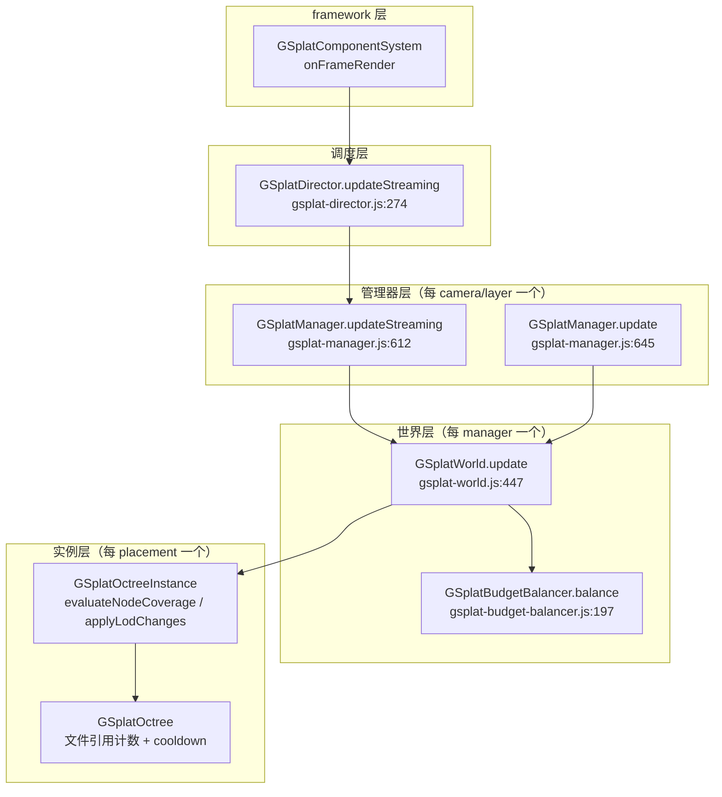
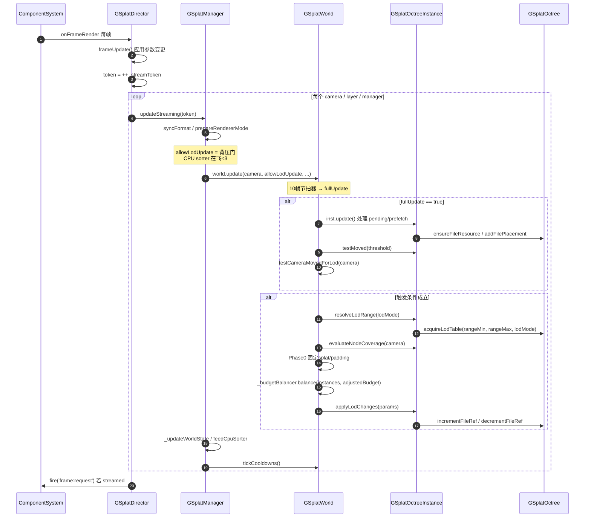
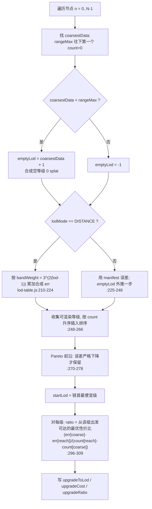
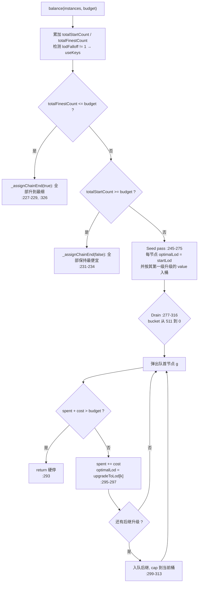
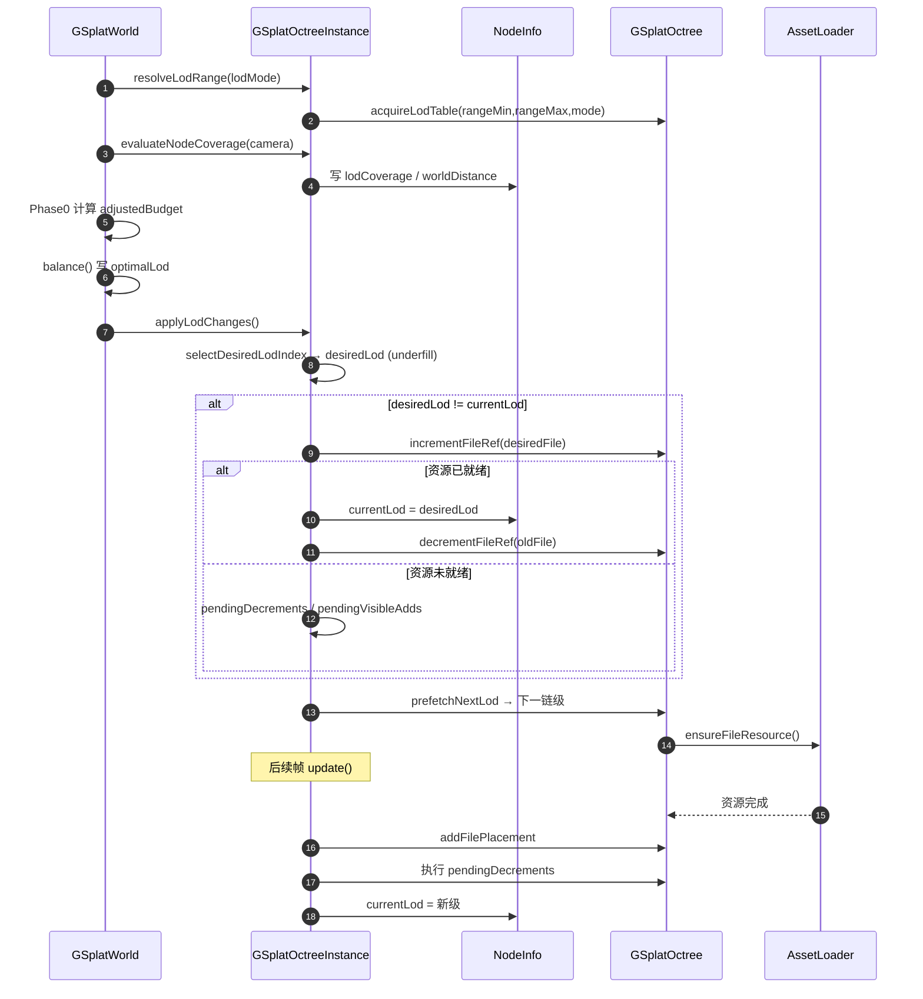

# PlayCanvas 大场景 3DGS LOD 瓦片升降级策略分析

> 分析对象：PlayCanvas Engine（`D:\Source\3DGS\playcanvas\engine`）当前 HEAD
> 模块：`src/scene/gsplat-unified/`
> 主题：流式 3DGS 大场景的八叉树 LOD 瓦片升降级（选择）策略

---

## 0. 术语与结论速览

- **“瓦片”不是独立子系统**：大场景 3DGS 的“瓦片”就是一个**八叉树叶节点** `GSplatOctreeNode`；瓦片升降级 = 节点在其 **LOD 链**上的精细/粗糙切换。
- **不是距离阈值升降级**：当前实现是**全局 splat 预算分配器**。每轮把所有节点压到最便宜等级作地板，再按 `屏幕覆盖率 × 单位 splat 误差收益`（性价比）贪心购买**单级升格**，直到预算装不下的第一级为止。
- **降级是隐式的**：没有独立降级分支——每轮从地板重新开始，没买到升格的节点自然停在粗级。
- **预算默认 1,000,000**（`SPLAT_BUDGET_DEFAULT`），且**始终强制**；非正值不再是“禁用”。
- **`lodMode` 默认 `GSPLAT_LODMODE_DISTANCE`（距离分带）**，可选 `GSPLAT_LODMODE_ERROR`（误差驱动）。

### 核心参与者

| 角色 | 类 / 方法 | 文件:行 |
|---|---|---|
| 每帧调度 | `GSplatDirector.updateStreaming` | `gsplat-director.js:274` |
| 管理器入口 | `GSplatManager.updateStreaming` / `update` | `gsplat-manager.js:612` / `:645` |
| 世界调度 / 触发 | `GSplatWorld.update` | `gsplat-world.js:447` |
| 三阶段预算执行 | `GSplatWorld._enforceBudget` | `gsplat-world.js:1122` |
| LOD 链预计算 | `GSplatLodTable` 构造函数 | `gsplat-lod-table.js:159` |
| 预算选择算法 | `GSplatBudgetBalancer.balance` | `gsplat-budget-balancer.js:197` |
| 实例状态 / 覆盖率 / streaming | `GSplatOctreeInstance` | `gsplat-octree-instance.js` |
| 文件引用计数 / cooldown | `GSplatOctree` | `gsplat-octree.js:358,419,437,488,520` |
| 参数（budget / falloff / underfill / mode） | `GSplatParams` | `gsplat-params.js` |
| 常量（默认预算 / 桶数） | `SPLAT_BUDGET_DEFAULT` / `NUM_VALUE_BUCKETS` | `gsplat-unified/constants.js:16,25` |

---

## 1. 数据模型

一个“瓦片”= 一个八叉树叶节点 `GSplatOctreeNode`（`gsplat-octree-node.js`）。

### `NodeInfo`（每节点 LOD 状态，`gsplat-octree-instance.js:43`）

| 字段 | 行 | 含义 |
|---|---|---|
| `currentLod` | `:47` | 当前**渲染**的等级（-1 = 不可见） |
| `optimalLod` | `:53` | 分配器选择的目标等级（underfill 前） |
| `worldDistance` | `:59` | 相机到节点世界距离 |
| `lodCoverage` | `:67` | 投影屏幕覆盖率（唯一的视角信号） |
| `resetLod()` | `:91` | 全部置 -1 |

### `GSplatLodTable`（每 (octree, range, mode) 预计算一次）

| 字段 | 行 | 含义 |
|---|---|---|
| `startLod` / `startCount` | `gsplat-lod-table.js:91,98` | 每节点最便宜可渲染级（地板）及其 splat 数 |
| `firstUpgrade` | `:107` | 每节点升级切片边界（长度 N+1） |
| `upgradeToLod` | `:114` | 每级升级到达的 LOD |
| `upgradeCost` | `:121` | 每级升级的额外 splat（恒 > 0） |
| `upgradeRatio` | `:134` | 每多 1 splat 去掉的误差（可达最优定价） |
| `totalStartCount` / `totalFinestCount` | `:142,150` | 全场地板 / 全升到最细的 splat 代价 |
| `lodMode` / `rangeMin` / `rangeMax` / `refCount` | `:57,64,72,82` | 表身份与引用计数 |

### 整体架构图



---

## 2. 每帧调度与触发门控

关键点：**LOD 重算不是每帧都跑**。

### 2.1 节拍器 + 背压门（`gsplat-world.js:466-479`）

```js
// gsplat-world.js:466-479
if (--this._framesTillFullUpdate <= 0) {   // 10 帧节拍器
    this._framesTillFullUpdate = 10;
    this._lodUpdateRequested = true;        // 门闩
}
let fullUpdate = false;
if (this._lodUpdateRequested && allowLodUpdate) {   // 背压门
    fullUpdate = true;
    this._lodUpdateRequested = false;
}
```

- **节拍器**：每 10 帧拉一次 `_lodUpdateRequested`（`:467-470`）。
- **背压门** `allowLodUpdate`：CPU sorter 在飞任务 < 3 才放行（`gsplat-manager.js:630`）。被推迟的 tick 下一帧补执行，不丢失（`:472-475`）。
- 相机移动/旋转检查、实例 pending 处理、`testMoved` **只在 `fullUpdate` 块内执行**（`:488-523`）。

### 2.2 实际触发条件（`gsplat-world.js:549`）

```js
// gsplat-world.js:549
if (cameraMovedOrRotatedForLod || anyOctreeMoved || this._gsplat.dirty ||
    anyInstanceNeedsLodUpdate || hasNewInstances) {
    ...
    this._enforceBudget(budget, camera);   // :570
}
```

相机阈值判定 `testCameraMovedForLod`（`gsplat-world.js:1028`），三个独立条件：

| 条件 | 参数 | 默认 |
|---|---|---|
| 相机平移 | `lodUpdateDistance`（`:1031-1036`） | 1 |
| 相机旋转 | `lodUpdateAngle`（`:1040-1052`） | 0（关闭） |
| FOV 变化 | 相对变化 > 2%（`:1055-1057`） | — |

所以实际重算频率 ≈ 每 10 帧一次，外加参数脏（`_gsplat.dirty`）时立即触发。

### 2.3 每帧时序图



---

## 3. 三阶段预算执行 `_enforceBudget`（`gsplat-world.js:1122`）

```js
// gsplat-world.js:1126-1139 Phase 0：扣掉非八叉树固定 splat + 纹理 padding
const octreeBudget = Math.max(1, budget - fixedSplats);

// :1143-1151 Phase 1：每实例解析范围 + 计算覆盖率
for (const [, inst] of this._octreeInstances) {
    inst.resolveLodRange(this._gsplat.lodMode);
    inst.evaluateNodeCoverage(camera, this._gsplat);
    ...
}
const adjustedBudget = Math.max(1, octreeBudget - paddingEstimate);  // :1154

// :1157 Phase 2：全局选择
this._budgetBalancer.balance(this._octreeInstances, adjustedBudget);

// :1160-1162 Phase 3：落到 streaming
for (const [, inst] of this._octreeInstances) inst.applyLodChanges(this._gsplat);
```

- 预算默认 **1,000,000**（`constants.js:16`，`gsplat-params.js:473`）。
- 非正值会告警并回退默认，不再表示“禁用”（`gsplat-world.js:565-570`）。
- 预算 = 全场景所选 LOD 的 splat 总和（含非流式固定 splat），**不是视锥内计数**。
- `lodRangeMin` / `lodRangeMax` 从 placement 读取并夹到 `[0, lodLevels-1]`（`gsplat-octree-instance.js:472`）。

---

## 4. LOD 链预计算：`GSplatLodTable`（`gsplat-lod-table.js:159`）

每 (octree, rangeMin, rangeMax, lodMode) 构建并缓存一次，引用计数管理
（`gsplat-octree.js:358 acquireLodTable` / `:379 releaseLodTable`）。



### 4.1 Pareto 前沿（`:270-278`）

```js
// gsplat-lod-table.js:270-278
let frontierCount = 0;
let bestError = Infinity;
for (let i = 0; i < candidateCount; i++) {
    const lod = scratch[i];
    if (err[lod] < bestError) {        // 只有误差严格更小才保留
        bestError = err[lod];
        scratch[frontierCount++] = lod;
    }
}
```

剔除“更贵且更差”的级。要求**严格**下降，可同时合并 count 与 error 都相同的级，保证每级升级成本恒 > 0。

### 4.2 空等级 emptyLod（`:199-208`）

节点数据在 `rangeMax` 前就断掉时，合成一个 0 splat、无文件、误差比最粗数据再差一步的链首。
**意义**：远处节点可以“降级到完全不渲染”，而不是被迫为一个节点加载整个文件。

```js
// gsplat-lod-table.js:208
const emptyLod = (coarsestData >= 0 && coarsestData < rangeMax) ? coarsestData + 1 : -1;
```

### 4.3 性价比的“可达最优”定价（`:296-309`）

`upgradeRatio` **不是本级斜率**，而是从本级出发能到达的最优性价比：

```js
// gsplat-lod-table.js:303-309
let ratio = 0;
for (let j = i; j < frontierCount; j++) {
    const reach = scratch[j];
    const r = (err[coarseLod] - err[reach]) /
              (lods[reach].count - lods[coarseLod].count);
    if (r > ratio) ratio = r;
}
```

反例（注释给出）：`(20,10) → (90,8) → (100,0)`。第一步本地看是“去 2 误差 / 70 splat”很亏，
但按“整段可达 10 误差 / 80 splat”定价，就不会输给别处的劣质升级。

> 这个定价为什么要用“可达最优”而不是“本级斜率”，以及 review 中一度尝试、最终被回退的
> concave hull 方案，见 [9.5.1 节](#951-从-concave-hull-到-reach-定价9233-的数学核心)（含示意图）。

### 4.4 两种模式

| 模式 | 常量 | 误差来源 | 特性 |
|---|---|---|---|
| `GSPLAT_LODMODE_DISTANCE`（**默认**） | `src/scene/constants.js:1303` | 合成 `3^(2(lod-1))`（`gsplat-lod-table.js:188`） | 每级 error-per-splat 跨节点为常数 → 内容抵消 → 纯距离分带 |
| `GSPLAT_LODMODE_ERROR` | `src/scene/constants.js:1293` | manifest 误差；缺失时 `ln(ref/count)` 派生（`gsplat-octree.js:317`） | 把预算花在“最省误差”处，提升稀疏/低质区域 |

距离模式的合成误差（`gsplat-lod-table.js:210-224`）：

```js
// gsplat-lod-table.js:213-224
for (let lod = rangeMin; lod <= rangeMax; lod++) {
    if (lods[lod].count <= 0) continue;
    if (finerCount >= 0) {
        e += Math.max(finerCount - lods[lod].count, 1) * bandWeight[lod];
    }
    err[lod] = e;
    finerCount = lods[lod].count;
}
```

---

## 5. 选择算法：`GSplatBudgetBalancer.balance`（`gsplat-budget-balancer.js:197`）



### 5.1 排序键与分桶

**value = `coverage × upgradeRatio`**（`:272`）。

```js
// gsplat-budget-balancer.js:13-16  正浮点位模式做 log 分桶
const keyOf = (value) => { _f32[0] = value; return _u32[0]; };

// :32-34  固定窗口 [1e-24, 1e3] → 512 桶
const KEY_LO = keyOf(1e-24);
const KEY_HI = keyOf(1e3);
const KEY_SCALE = (NUM_VALUE_BUCKETS - 1) / (KEY_HI - KEY_LO);
```

**固定刻度**（而非按当轮数值范围）是防闪烁的关键：范围漂移会让无变化的节点跨桶 → flicker（注释 `:18-20`）。
桶数 512（`constants.js:25`）。

### 5.2 三个决定时间稳定性的设计

**(1) 硬停而非跳过**（`:291-295`）：遇到第一个装不下的升级就整体结束。

```js
// gsplat-budget-balancer.js:291-295
const k = pending[g];
const cost = table.upgradeCost[k];
if (spent + cost > budget) return;   // 第一个装不下就停止整个扫描
spent += cost;
```

理由（注释 `:55-59`）：继续扫会让某节点的结果取决于“某个无关便宜升级是否先被遍历到”，
小幅相机移动就翻转等级 → 闪切。代价是可能留下未花完的预算。

**(2) 后继入队钳在正在排空的桶**（`:299-313`）：因为 `upgradeRatio` 是“可达最优”，
后继可能比刚买的更值。钳回当前桶，保证一次 run 在同一轮扫描内完成
（否则每轮重铺地板会把它永远丢弃）。

```js
// gsplat-budget-balancer.js:309-312
const target = useKeys ?
    this._bucketOfKey(coverageKey[g] + keyOf(table.upgradeRatio[k2]) - KEY_ONE) :
    this._bucketOf(coverage[g] * table.upgradeRatio[k2]);
this._push(target > bucket ? bucket : target, g);
```

**(3) 每节点同时只有一条在队**（`:61-63`）：桶是预分配 typed array 上的侵入式链表，零 per-entry 分配。

### 5.3 升降级的本质


**降级没有独立分支**——每轮从地板重新开始，被别处抢走预算的节点自然停在粗级。
好处是升降级完全对称、无状态残留。

---

## 6. 覆盖率：唯一的视角信号（`gsplat-octree-instance.js:509`）

背后惩罚（可选，`:591-600`）：

```js
// gsplat-octree-instance.js:591-600
if (lodBehindPenalty > 1 && actualDistance > 0.01) {
    const dotOverDistance = (fwx * dx + fwy * dy + fwz * dz) / actualDistance;
    if (dotOverDistance < 0) {
        penaltyFactor = 1 + (-dotOverDistance) * (lodBehindPenalty - 1);
    }
}
const fovAdjustedDistance = actualDistance * penaltyFactor * fovScale;   // :602
```

三条分支（`:610-630`）：

```js
// distance 模式：逆平方，节点尺寸被刻意忽略（等距节点同优先级 → 干净距离带）
const worldDist = Math.max(fovAdjustedDistance * uniformScale, 1e-6);
coverage = 1 / (worldDist * worldDist);
// 正交：半径对正交窗口，无距离项
const projectedRadius = Math.min(radius * invOrthoHeight, 1);
coverage = (projectedRadius * projectedRadius) / (penaltyFactor * penaltyFactor);
// 透视：投影半径平方
const projectedRadius = radius / Math.max(radius + fovAdjustedDistance, 1e-12);
coverage = projectedRadius * projectedRadius;
```

- FOV 补偿：`min(tanHalfV, tanHalfH) / REF_TAN_HALF_FOV`（`:523-531`）。
- `lodFalloff`（每 placement，`component.js:391`）在 **key 空间**以 `1e-4` 为轴心做幂
  （`gsplat-budget-balancer.js:266-271`），只倾斜近/远场，不整体压缩该 placement。
- 任何实例 `lodFalloff !== 1` 时，全部排序切到 key 空间路径（`:211-222`）。

---

## 7. Streaming 落地：从 optimal 到实际显示（`gsplat-octree-instance.js:642`）

`applyLodChanges` 对每节点：

### 7.1 underfill 保底（`selectDesiredLodIndex`，`:399`）

目标级没加载好时，沿 LOD **链**（非原始 index，防 splat 数倒挂）在 `lodUnderfillLimit` 步内
找已加载的最细级；空等级永远合格。

```js
// gsplat-octree-instance.js:407-410
const loaded = table.findCoarserAccepted(nodeIndex, optimalLodIndex, lodUnderfillLimit, (lod) => {
    const fi = node.lods[lod].fileIndex;
    return fi === -1 || !!this.octree.getFileResource(fi);
});
if (loaded >= 0) return loaded;
```

### 7.2 逐级预取（`prefetchNextLod`，`:436`）

只朝 optimal 走**一步**链，避免一次跳多级、避免细级请求盖过粗级。

```js
// gsplat-octree-instance.js:454-458
const targetLod = this.lodTable.finerOnChain(nodeIndex, desiredLodIndex);
if (targetLod < 0) return;
const fi = node.lods[targetLod].fileIndex;
if (fi !== -1) {
    this.octree.ensureFileResource(fi);
    ...
}
```

### 7.3 三种可见性切换（`:687-746`）

| 分支 | 行 | 行为 |
|---|---|---|
| 不可见 → 可见 | `:687-708` | increment 新文件；资源就绪则立即显示，否则挂 `pendingVisibleAdds` |
| 可见 → 不可见 | `:710-722` | 取消 pending，decrement 当前文件，`currentLod = -1` |
| 可见 → 可见（换级） | `:724-746` | increment 新文件；就绪则立刻 decrement 旧文件并切换；否则挂 `pendingDecrements` 保留旧级直到新级到货（防闪烁） |

### 7.4 pending 完成与释放（`update()`，`:902`）

`pendingDecrements` 在目标文件加载完成后才真正递减旧文件（`:922-938`）；
若期间目标又变，则取消前一个 pending（`:667-685`）。

### 7.5 文件引用计数与 cooldown（`gsplat-octree.js`）

- `incRefCount`（`:419`）：+1 并取消 cooldown。
- `decRefCount`（`:437`）：归零时 `cooldownTicks==0` 立即卸载，否则排 cooldown。
- `updateCooldownTick`（`:488`）：每帧递减，到期且引用仍为 0 才卸载。
- `ensureFileResource`（`:520`）：加载并在完成后回填 `fileResources`。

### 7.6 升降级 + streaming 完整时序图



---

## 8. 参数速查

| 参数 | 默认 | 行 | 说明 |
|---|---|---|---|
| `splatBudget` | 1,000,000 | `gsplat-params.js:473` | 全局 splat 预算，始终强制 |
| `lodMode` | `GSPLAT_LODMODE_DISTANCE` | `gsplat-params.js:503` | 距离分带 / 误差驱动 |
| `lodUpdateDistance` | 1 | `:371` | 相机/实例平移触发阈值 |
| `lodUpdateAngle` | 0 | `:377` | 旋转触发阈值（0 = 关） |
| `lodBehindPenalty` | 1 | `:380` | 背后节点距离惩罚 |
| `lodUnderfillLimit` | 0 | `:446` | underfill 允许的粗级步数（0 = 关） |
| `lodFalloff` | 1 | `component.js:391` | 每 placement 近/远场预算倾斜，钳 [0,8] |
| `lodRangeMin` / `lodRangeMax` | 0 / max | `component.js:453,477` | 每 placement 允许的 LOD 范围 |
| `cooldownTicks` | — | `gsplat-params.js:880` | 文件卸载宽限帧数 |

已废弃/移除：`GSplatComponent#splatBudget`、`lodBaseDistance`、`lodMultiplier`、`lodDistances`
（`component.js:409-527`），改为 `app.scene.gsplat.splatBudget` 全局控制。

---

## 9. 版本演进对照（历史升降级策略）

当前实现是四轮演进的结果。理解每一轮解决什么问题，比只看当前代码更能看清设计取舍。

### 9.1 时间线

| # | commit | 日期 | 主题 | 引擎默认预算 | 升降级策略 |
|---|---|---|---|---|---|
| #8217 | `d3c25b74c` | 2025-12 | Adds a soft limit on total splat count rendered for streaming lod | `0`（禁用） | **距离重要性软降级**（可选） |
| #8444 | `6901957f9` | 2026-02 | Global splat budget for scene-wide GSplat LOD management | `0`（仍可选） | **距离分桶的双向调整** |
| #8506 | `b319ef832` | 2026-03 | Improve GSplat LOD system with geometric progression… | — | 几何级数 + FOV 补偿 + 修正单调性 |
| #9233 | `32476eee0` | 2026-08 | Error-driven GSplat LOD selection with a derived fallback | **`1000000`（1M）** | **误差驱动、始终强制、性价比贪心** |

补充：**“400 万”从来不是引擎默认值**，它是 `lod-streaming` 示例的桌面 UI 预设
（`d3c25b74c` 引入 `data.set('splatBudget', mobile ? '1M' : '4M')`，今天示例仍是桌面 4M / 移动 1M，
见 `examples/src/examples/gaussian-splatting/lod-streaming.example.mjs:265`）。

### 9.2 #8217：距离重要性软降级（已删除）

流程：先按距离算每节点 `optimalLod`（`evaluateNodeLods`），若总数超预算，再
`enforceSplatBudget` 按 **importance（距离反比）** 从低到高、每次降一级，多轮直到进预算。

```js
// #8217 引入（现已删除）
const importance = (1.0 - Math.min(actualDistance / maxDistance, 1.0)) * importanceMultiplier;
nodeInfos[nodeIndex].importance = importance;

// 排序后从最不重要的节点开始逐级降
nodeIndices.sort((a, b) => nodeInfos[a].importance - nodeInfos[b].importance);
while (currentSplats > splatBudget) {
    ...
    nodeInfo.optimalLod = currentOptimalLod + 1;   // 降一级
    currentSplats -= splatsSaved;
}
```

特点与局限：

- **只能降、不能升**：一旦进预算就停，没有“预算富余时提升质量”的路径。
- **决策依据是距离**，与“该级实际损失多少质量”无关——近处低细节节点和远处高细节节点同等对待。
- `splatBudget = 0` 表示**禁用**（纯距离 LOD）。

### 9.3 #8444：距离分桶双向调整（已被替换）

引入独立的 `GSplatBudgetBalancer`，首次把“预计算 + 排序”拆出来：

- **64 个 sqrt 距离桶**（`NUM_BUCKETS = 64`），bucket 0 = 最近、最高优先级。
  用 `sqrt(worldDistance / globalMaxDistance)` 分布，让近处获得更细粒度。
- **超预算 → 降级**：从最远桶往近桶扫，每节点降一级。
- **低于预算 → 升格**：从最近桶往远桶扫，能装下就升一级。
- 多轮（每轮一级）直到进预算或撞到 `rangeMin`/`rangeMax`。

```js
// #8444 引入（现已替换）
const bucket = (Math.sqrt(nodeInfo.worldDistance) * bucketScale) >>> 0;
// 超预算：b = NUM_BUCKETS-1 → 0（先牺牲远处）
// 不足：  b = 0 → NUM_BUCKETS-1（先提升近处）
```

这一版比 #8217 多了**双向**和**分桶**，但决策依据仍是**距离**，不是质量损失。

### 9.4 #8506：几何级数 + FOV 补偿（增量改进）

- 用 `lodBaseDistance + lodMultiplier` 的**几何级数**替换线性 `lodDistances` 数组，
  LOD 计算变成 O(1) 对数。
- 加入 **FOV 补偿**。
- 修正预算分配器的**单调性**问题。

这一版奠定了“距离分带”的雏形，但仍是距离驱动。

### 9.5 #9233：误差驱动 + 始终强制（当前）

一次范式转变：

1. **决策依据从距离改为“实际质量损失”**。每节点预计算 Pareto 链（`GSplatLodTable`），
   排序键变为 `屏幕覆盖率 × 单位 splat 误差收益`。
   commit 注释给出的实测：在三个 capture 上与 authored errors 对比，派生代理落在 2–17% 内，
   而被替换的距离系统差 20–790%。
2. **预算从“可选软限制”变为“始终强制”**。`lodBaseDistance` / `lodMultiplier` 变为惰性并被移除；
   `splatBudget <= 0` 不再是“禁用”，而是告警后用默认值
   （`gsplat-world.js:565-570`）。
3. **分配器重写**：`_bucketOf` / `keyOf` 用正浮点位模式的固定 log 刻度（512 桶），
   替代 sqrt 距离桶；排序键从“距离”变为“性价比”。
4. **降级方式改变**：不再是“超预算时按距离逐级降”，而是**每轮重铺最便宜地板 + 只买装得下的升格**——
   降级成为隐式结果，升降级对称。
5. **误差来源**：manifest 存在则用 authored errors，否则按 `ln(refCount/count)` 派生
   （`gsplat-octree.js:317 _deriveLodErrors`），单一代码路径。
6. **升级定价的迭代**：review 过程中一度把每节点化简为 **upper concave hull（上凸包）** 来消除
   斜率非单调，但该做法会删掉真实有用的中间等级，最终**回退为“保留完整 Pareto 链 + 用可达最优
   （reach）给每一级定价”**。详见下一节 9.5.1。

### 9.5.1 从 concave hull 到 reach 定价（#9233 的数学核心）

这一节解释当前 `upgradeRatio` 那个看似绕的循环为什么长这样
（`gsplat-lod-table.js:296-309`）。

**问题**：Pareto 前沿只保证“误差随成本单调下降”，**不保证边际收益递减**——相邻等级的斜率
（`Δerror / Δcount`）可以在更细的一端反而变大。举 commit 里的例子，某节点三个等级：

```
等级 (count, error):  A(20, 10)  →  B(90, 8)  →  C(100, 0)
```

- A→B：成本 70 splat，去掉 2 误差，斜率 = 2/70 ≈ 0.0286
- B→C：成本 10 splat，去掉 8 误差，斜率 = 8/10 = 0.8

**如果按“本级自身斜率”定价**，A→B 看起来极差（0.0286），于是这节点在性价比排序里输给别处
一些真正更差的升级，被永远卡在最粗的 A——尽管只要花 80 splat 就能一路走到误差为 0 的 C。
这就是“局部定价”的误判。

**方案一（被回退）：upper concave hull。**
把 (count, −error) 上的点做上凸包，把落在某条弦下方的中间级“合并”成一个复合升级。
凸包保证斜率非单调递减，clamp 可以去掉。但它**删除了中间等级**——实测删掉 20–25% 的
Pareto 等级、影响 70–86% 的节点，而这些等级每一个都在严格降误差、且是 streaming/underfill
可能经过的状态。所以不合适。

**方案二（最终落地）：保留完整链 + reach 定价。**
不删除任何等级，改为把“每个升级的价值”定义为**从该级出发、沿链继续前进所能达到的最优性价比**
（而不是它自己的斜率）：

```js
// gsplat-lod-table.js:303-309
let ratio = 0;
for (let j = i; j < frontierCount; j++) {
    const reach = scratch[j];
    const r = (err[coarseLod] - err[reach]) /
              (lods[reach].count - lods[coarseLod].count);
    if (r > ratio) ratio = r;   // 取可达的最优性价比
}
```

对例子里的 A→B：循环会看到从 A 出发能到 C，`(10 - 0) / (100 - 20) = 10/80 = 0.125`，
于是 A→B 这一步被定价为 0.125（而不是 0.0286），在全局排序里就公平地跟别处竞争了。
买下 A→B 后，balancer 再把 B→C 入队，**一步一步爬**，而不是一步跳到 C。

**一个必须配套的细节**：因为 value 是“可达最优”，它沿链**不是单调的**——刚买的那一步可能
比它的后继更值，于是后继入队时会落到“已经扫过”的更高桶。`balance` 用“把后继入队桶
钳到当前正在排空的桶”（`gsplat-budget-balancer.js:309-312`）来解决，保证一次 run 在同一轮
扫描内完成。**这两处是一对**：reach 定价制造了非单调 value，钳桶兜住了它。

```mermaid
flowchart TB
    subgraph Chain["节点 LOD 链 (count 升, error 降)"]
        A["A<br/>count=20<br/>error=10"] --> B["B<br/>count=90<br/>error=8"] --> C["C<br/>count=100<br/>error=0"]
    end

    subgraph Local["[弃用] 局部定价"]
        L1["A→B slope = 2/70 ≈ 0.029"]
        L2["B→C slope = 8/10 = 0.8"]
        L3["A→B 显得极差<br/>节点被卡在最粗 A"]
        L1 --> L3
        L2 --> L3
    end

    subgraph Reach["[当前] reach 定价"]
        R1["A→B 记为<br/>max over reach:<br/>(10-8)/70, (10-0)/80")
        R2["= 10/80 = 0.125<br/>(可到 C 的最优)"]
        R3["A→B 公平参与竞争<br/>买到后 B→C 入队<br/>逐步爬升"]
        R1 --> R2 --> R3
    end

    subgraph Hull["[回退] concave hull（中间方案）"]
        H1["(count, -error) 上凸包<br/>弦下方等级被合并"]
        H2["斜率单调递减, clamp 消失"]
        H3["但删除 20-25% 等级<br/>影响 70-86% 节点<br/>删掉了真实可用的中间态"]
        H1 --> H2 --> H3
    end

    Chain -.->|同一组等级| Local
    Chain -.->|同一组等级| Reach
    Chain -.->|同一组等级| Hull
```

**为什么最终选 reach 而不是 hull**：reach 定价既恢复了 hull 想修的“误定价”（端到端实测残差误差
比旧的 running-minimum 定价低 1–17%），又**不删除任何等级**——链同时是 streaming 与 underfill
允许经过的状态集合，删级会让 underfill 失去可用等级、让 prefetch 的“一级爬升”变成跳级。


### 9.6 三代策略的核心差异

| 维度 | #8217 | #8444 | #9233（当前） |
|---|---|---|---|
| 方向 | 只降 | 双向 | 双侧对称（每轮重铺 + 买升格） |
| 决策依据 | 距离 → importance | 距离分桶 | 覆盖率 × 误差/splat |
| 预计算 | 无 | 无（运行期） | Pareto 链 + 性价比表 |
| 预算语义 | 0 = 禁用 | 0 = 禁用 | 始终强制，非正 → 默认 |
| 默认预算 | 0 | 0 | 1,000,000 |
| 降级机制 | 超预算逐级降 | 超预算按桶降 | 隐式（重铺地板未买到升格） |
| 闪烁控制 | 无专门设计 | 无专门设计 | 固定刻度分桶 + 硬停 + 每轮重铺 |
| 数据依赖 | 无 | 无 | manifest 误差（可选，缺失派生） |


### 9.7 为什么旧方案被弃用

- **距离不等于质量损失**（#9233 注释）：近重复 splat 的节点和携带精细细节的节点，
  在同一距离被打成同一处理，浪费预算。
- **只降不升**（#8217）：预算富余时无法回填质量。
- **每轮按距离逐级降**（#8217/#8444）：升降级不对称、无状态记忆，靠近相机时容易反复。
- **预算可选**（#8217/#8444）：场景要么完全无预算约束，要么手动调一个跟内容无关的阈值；
  默认 1M 让行为开箱可预期。

---

## 10. 关键文件索引

| 角色 | 文件:行 |
|---|---|
| 调度 / 触发 / 三阶段 | `src/scene/gsplat-unified/gsplat-world.js:447, :1028, :1122` |
| LOD 链预计算 | `src/scene/gsplat-unified/gsplat-lod-table.js:159` |
| 预算选择算法 | `src/scene/gsplat-unified/gsplat-budget-balancer.js:197` |
| 实例状态机 / 覆盖率 / streaming | `src/scene/gsplat-unified/gsplat-octree-instance.js:399, :436, :509, :642, :902` |
| 文件引用计数 / cooldown | `src/scene/gsplat-unified/gsplat-octree.js:358, :419, :437, :488, :520` |
| 参数 | `src/scene/gsplat-unified/gsplat-params.js:371, :446, :473, :503` |
| 常量 | `src/scene/gsplat-unified/constants.js:16, :25` |
| 每帧驱动 | `src/scene/gsplat-unified/gsplat-director.js:274`、`gsplat-manager.js:612` |
| 行为规格测试 | `test/scene/gsplat-unified/gsplat-budget-balancer.test.mjs`、`gsplat-lod-table.test.mjs` |

---

## 11. 一句话总结

> 先给每个八叉树节点预计算一条“升级性价比链”，每轮把全场景节点压到最便宜等级，
> 再按 `屏幕覆盖率 × 单位 splat 误差收益` 贪心购买升格，直到预算装不下的第一级为止；
> 降级由“每轮重铺地板”隐式完成；streaming 用 underfill 保底 + 逐级 prefetch + pending 切换，
> 保证不闪不空。
