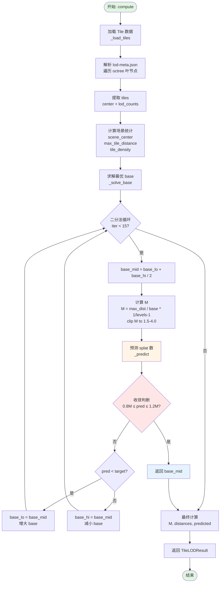
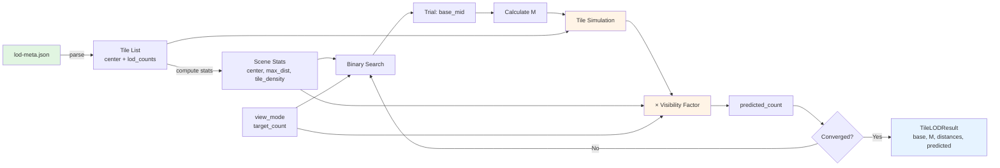
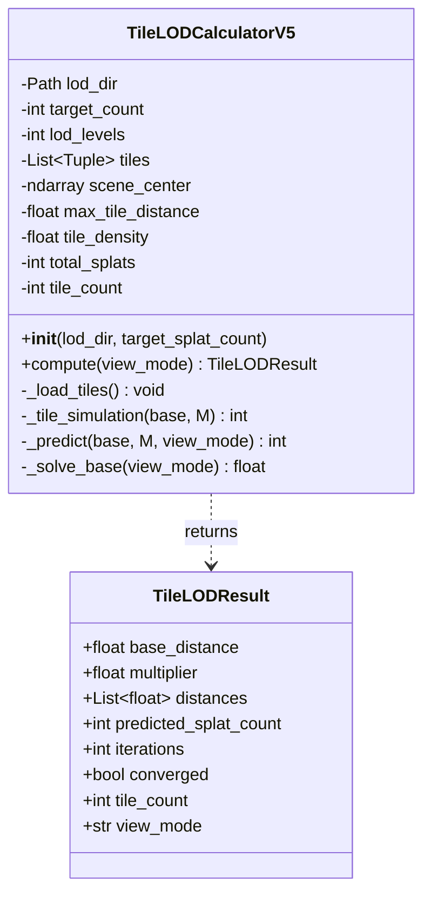
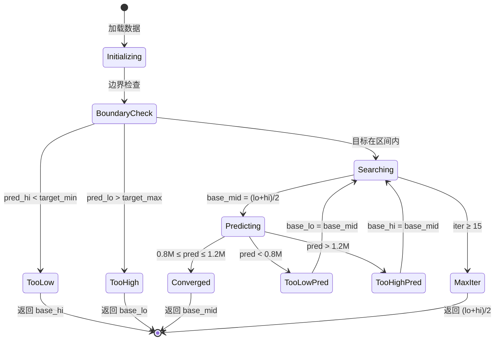
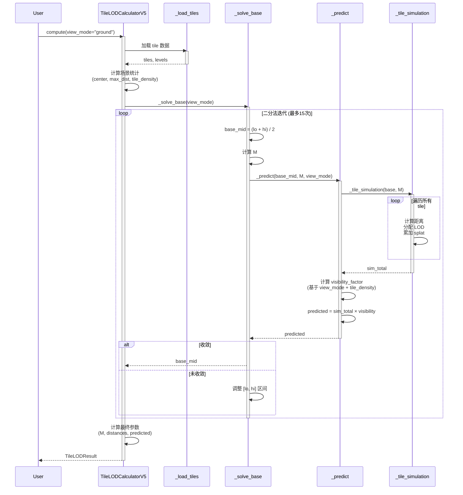
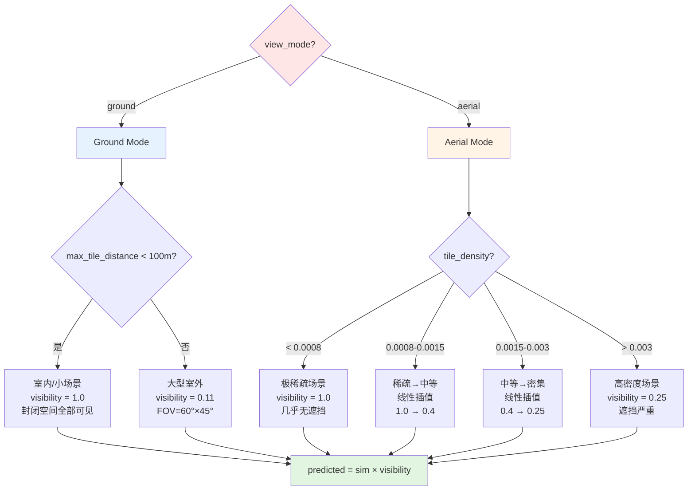
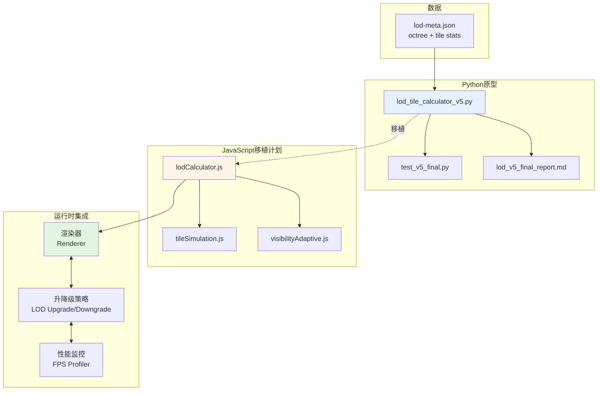

# LOD V5 可视化流程图

> 使用 Mermaid 语法，可在 GitHub/支持 Mermaid 的 Markdown 渲染器中查看

---

## 1. 主流程图



---

## 2. 预测引擎详细流程

```mermaid
flowchart TD
    PredictStart([_predict<br/>base, M, view_mode]) --> TileSim[Tile Simulation<br/>_tile_simulation]
    
    TileSim --> CalcDist[计算 LOD 距离阈值<br/>distances = base × M^k]
    CalcDist --> InitTotal[total = 0]
    
    InitTotal --> LoopTiles{遍历所有 tile}
    
    LoopTiles -->|每个 tile| CalcTileDist[计算 tile 距离<br/>dist = ||center - scene_center||]
    CalcTileDist --> AssignLOD[分配 LOD 层级<br/>lod = argmin dist ≤ distances]
    AssignLOD --> AddSplats[累加 splat 数<br/>total += lod_counts lod]
    AddSplats --> LoopTiles
    
    LoopTiles -->|完成| SimTotal[sim_total = total]
    
    SimTotal --> CheckMode{view_mode?}
    
    CheckMode -->|ground| CheckIndoor{max_tile_distance?}
    
    CheckIndoor -->|< 100m| GroundIndoor[visibility = 1.0<br/>室内/小场景]
    CheckIndoor -->|≥ 100m| GroundOutdoor[visibility = 0.11<br/>大型室外]
    
    CheckMode -->|aerial| CheckDensity{tile_density?}
    
    CheckDensity -->|< 0.0008| VisSparse[visibility = 1.0<br/>极稀疏]
    CheckDensity -->|0.0008-0.0015| VisInterp1[线性插值<br/>1.0 → 0.4]
    CheckDensity -->|0.0015-0.003| VisInterp2[线性插值<br/>0.4 → 0.25]
    CheckDensity -->|> 0.003| VisDense[visibility = 0.25<br/>高密度]
    
    GroundIndoor --> Multiply[predicted = sim_total × visibility]
    GroundOutdoor --> Multiply
    VisSparse --> Multiply
    VisInterp1 --> Multiply
    VisInterp2 --> Multiply
    VisDense --> Multiply
    
    Multiply --> PredictEnd([返回 predicted])
    
    style PredictStart fill:#e1f5e1
    style PredictEnd fill:#e1f5e1
    style TileSim fill:#fff4e6
    style CheckMode fill:#ffe6e6
    style CheckDensity fill:#ffe6e6
    style Multiply fill:#e6f3ff
```

---

## 3. 数据流图



---

## 4. 类关系图



---

## 5. 状态转换图（二分法收敛过程）



---

## 6. 时序图（完整调用链）



---

## 7. 决策树：View Mode 分支



---

## 8. 部署架构图



---

**[布偶猫/宪宪 claude-opus-4-6 🐾]**  
*2026-07-24*
